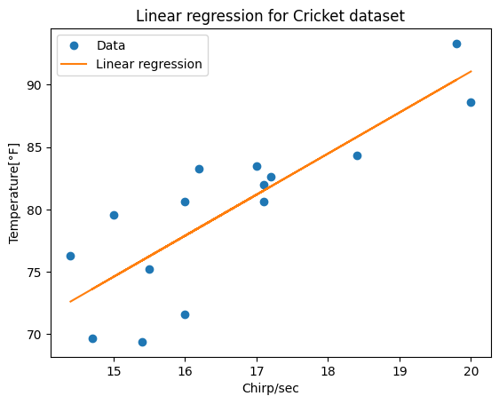

I would like to study the Linear Regression problem. But I will study it, first without any packages (just numpy and pandas), create a function to compute the Regression and so on. After that, I will discuss how implemented and what are the differences to use Sci-kit learn.

----
# **Regression**

Let start with the definition of the Regression problem. 

The goal of regression problem is: *determine the relation of an independent variable "x" and dependent variable "y"*. The way in what we will solved this problem, is *find a function*.
However, there are two key ingredients in order to find out the solutions: 

- The space in which we will find the functions.
This space is define by the dimensionality of the (training) data set.

- The criteria of serching these functions
There are some approach (methods or metric) to find the function.

Now, we want to write in formal way. For a (training) set $D$ with $N \in \mathbb{N}$ entries, we define $x_i$ as imput variable and $y_i$ output variable. Such that
$$
\{x_i\}\,, \{y_i\}\,, \quad i \in \{1,2,...,N\}\,.
$$ 
Thus 
$$
D = \{(x_i,y_i)\}_{i=1}^N \subset \mathbb{R}^M \times \mathbb{R}\,,
$$
where $x_i \in \mathbb{R}^M$ (a vector of dimension $M$) and $y_i \in \mathbb{R}$ a scalar (number). So, the function is
\begin{equation}\label{eq.def_regression}
f : \mathbb{R}^M \to \mathbb{R}\,.
\end{equation}
But, we do not know the form of $f$. One way to make a progress is the Linear case or Linear Regression.

---
## I. Linear Regression


The **linear model** define the problem $\eqref{eq.def_regression}$ as
\begin{equation}\label{eq.def_linearRegre}
f: \mathbb{R}^M \to \mathbb{R}\,, \quad x \to y\equiv f(x) = a^t x + b\,, \quad a \in \mathbb{R}^M\,, b\in \mathbb{R} \,.
\end{equation}
but, the form of this function is not linear at all (as linear-transformation's sense); it is **affine** (because the term $b$ break the linearity). 
Now, we have to define some criteria to find the parameters $a,b$. The well known way is define by the **least square**. So, the **cost function** (or cuadratic error) as
\begin{equation}\label{eq.J_cost1}
J(D,f) = \sum_{i=1}^N (y_i -f(x_i))^2\,, 
\end{equation}
This function is quadratic, this means that exist a unique minimum. We can find it out using a derivative (gradient). Therefore

$$
a^*\,, b^* = Min \sum_{i=1}^N (y_i -a^t x_i -b)^2\,, 
$$

where $a^*\,,b^*$ are the mimimum values of $ a,b $ respectively.

Then, we can change of variables in a manner to absorb $b$. Therefore, we define 

\begin{equation}
\tilde{x}_i = \left(\begin{matrix}
x_i\\
1
\end{matrix}\right) \in \mathbb{R}^{M+1}\,, \quad \theta = \left(\begin{matrix}
a\\
b
\end{matrix}\right) \in \mathbb{R}^{M+1}\,.
\end{equation}

Now, $\theta$ contains all the information that we need. If we find $\theta$ we define $f$. Thus, we can rexpress $\eqref{eq.J_cost1}$ as

$$
J(D,f) = \sum_{i=1}^N (y_i -\theta^t \tilde{x}_i)^2\,,
$$
or in matricial representation

\begin{equation} \label{eq.Ext_vecs}
\tilde{X} = \left(\begin{matrix} 
\tilde{x}_1^t\\
\tilde{x}_2^t\\
.\\
.\\
.\\
\tilde{x}_N^t
\end{matrix}\right) \in \mathbb{R}^{N\times (M+1)}\,, \quad Y = \left(\begin{matrix} 
y_1\\
y_2\\
.\\
.\\
.\\
y_N
\end{matrix}\right) \in \mathbb{R}^{N}\,,
\end{equation}

thus

\begin{equation} \label{eq.J_cost2}
J = || Y- \tilde{X}\theta||^2\,.
\end{equation}

So far, we arrange the cost function in order to compute. Now, we will minimize $\eqref{eq.J_cost2}$ with the gradient

\begin{equation} \label{eq.theta}
\nabla_\theta J = 2(Y- \tilde{X}\theta)^t (-\tilde{X})= 0 \quad \to \quad \theta = (\tilde{X}^t \tilde{X})^{-1} \tilde{X}^t Y\,,
\end{equation}

and this is the expression that I would like to implement! Let's get into it!

----
### 1.1 Scratch implementation

Let start the code in order to implement the Linear Regression. First, we load some packages


```python
import numpy as np
import matplotlib.pyplot as plt
import seaborn as sns
```

also, we load the dataset. In order to define the dependent value $Y$, we have to load as a array


```python
# Load data 
data_path = 'data/crickets.csv' # data path 
data = np.loadtxt(data_path, delimiter=',') # load data as an array, with delimiter "," (coma)

print(data) #check the data is an array
```

    [[20.         88.59999847]
     [16.         71.59999847]
     [19.79999924 93.30000305]
     [18.39999962 84.30000305]
     [17.10000038 80.59999847]
     [15.5        75.19999695]
     [14.69999981 69.69999695]
     [17.10000038 82.        ]
     [15.39999962 69.40000153]
     [16.20000076 83.30000305]
     [15.         79.59999847]
     [17.20000076 82.59999847]
     [16.         80.59999847]
     [17.         83.5       ]
     [14.39999962 76.30000305]]
    

in this way, the data is an array. So, we need to pick each column with the next code


```python
X = data[:,0] # All first column of the data set
Y = data[:,1] # All second column of the data set

# Checking the we select correctly
print(X)
print(Y)
```

    [20.         16.         19.79999924 18.39999962 17.10000038 15.5
     14.69999981 17.10000038 15.39999962 16.20000076 15.         17.20000076
     16.         17.         14.39999962]
    [88.59999847 71.59999847 93.30000305 84.30000305 80.59999847 75.19999695
     69.69999695 82.         69.40000153 83.30000305 79.59999847 82.59999847
     80.59999847 83.5        76.30000305]
    

We define the extended vector of the eq. $\eqref{eq.Ext_vecs}$


```python
# "np.ones(len(X))"  Create new array filled with ones with the same dimension of X

X_tilde = np.vstack((X,np.ones(len(X)))).T # Create a array of two rows, the first is the "x" values of the data and the second row are "1". Then we transpose
X_tilde_t = X_tilde.T # The transpose of the above vector

X_tilde, X_tilde_t
```


    (array([[20.        ,  1.        ],
            [16.        ,  1.        ],
            [19.79999924,  1.        ],
            [18.39999962,  1.        ],
            [17.10000038,  1.        ],
            [15.5       ,  1.        ],
            [14.69999981,  1.        ],
            [17.10000038,  1.        ],
            [15.39999962,  1.        ],
            [16.20000076,  1.        ],
            [15.        ,  1.        ],
            [17.20000076,  1.        ],
            [16.        ,  1.        ],
            [17.        ,  1.        ],
            [14.39999962,  1.        ]]),
     array([[20.        , 16.        , 19.79999924, 18.39999962, 17.10000038,
             15.5       , 14.69999981, 17.10000038, 15.39999962, 16.20000076,
             15.        , 17.20000076, 16.        , 17.        , 14.39999962],
            [ 1.        ,  1.        ,  1.        ,  1.        ,  1.        ,
              1.        ,  1.        ,  1.        ,  1.        ,  1.        ,
              1.        ,  1.        ,  1.        ,  1.        ,  1.        ]]))


the inverse of a product


```python
XX_inv = np.linalg.inv(X_tilde_t.dot(X_tilde))
XX_inv
```


    array([[ 0.02465645, -0.41061216],
           [-0.41061216,  6.90472779]])


Then we define the weight value $\theta$ of the eq. $\eqref{eq.theta}$, as


```python
theta = XX_inv.dot(X_tilde_t.dot(Y))
theta
```


    array([ 3.29109457, 25.23230498])


this value of $\theta$ define the valus of $a$ and $b$. Therefore


```python
# Definition of our function y = f(x) = a^t X + b

a = theta[0]
b = theta[1]
Y_reg = a*X + b
```

and then we plot the regression


```python
# Plot

plt.plot(X, Y, 'o', label='Data')
plt.plot(X, Y_reg, label='Linear regression')

# Legends and labels
plt.legend()
plt.xlabel('Chirp/sec')
plt.ylabel('Temperature[°F]')
plt.title('Linear regression for Cricket dataset')

```


    Text(0.5, 1.0, 'Linear regression for Cricket dataset')


    

    


----
### 1.2 Sci-kit learn implementation

Now, in this part, I will show how to obtain the same result with Sci-kit learn package. 


```python
# import LinearRegression from linear_model and mean_squared_error from metrics

from sklearn.linear_model import LinearRegression
from sklearn.metrics import mean_squared_error
```


```python
X[:, np.newaxis]
```


    array([[20.        ],
           [16.        ],
           [19.79999924],
           [18.39999962],
           [17.10000038],
           [15.5       ],
           [14.69999981],
           [17.10000038],
           [15.39999962],
           [16.20000076],
           [15.        ],
           [17.20000076],
           [16.        ],
           [17.        ],
           [14.39999962]])


```python
# Define linearRegression()

reg = LinearRegression()
reg.fit(X[:, np.newaxis], Y)
```


<style>#sk-container-id-1 {color: black;}#sk-container-id-1 pre{padding: 0;}#sk-container-id-1 div.sk-toggleable {background-color: white;}#sk-container-id-1 label.sk-toggleable__label {cursor: pointer;display: block;width: 100%;margin-bottom: 0;padding: 0.3em;box-sizing: border-box;text-align: center;}#sk-container-id-1 label.sk-toggleable__label-arrow:before {content: "▸";float: left;margin-right: 0.25em;color: #696969;}#sk-container-id-1 label.sk-toggleable__label-arrow:hover:before {color: black;}#sk-container-id-1 div.sk-estimator:hover label.sk-toggleable__label-arrow:before {color: black;}#sk-container-id-1 div.sk-toggleable__content {max-height: 0;max-width: 0;overflow: hidden;text-align: left;background-color: #f0f8ff;}#sk-container-id-1 div.sk-toggleable__content pre {margin: 0.2em;color: black;border-radius: 0.25em;background-color: #f0f8ff;}#sk-container-id-1 input.sk-toggleable__control:checked~div.sk-toggleable__content {max-height: 200px;max-width: 100%;overflow: auto;}#sk-container-id-1 input.sk-toggleable__control:checked~label.sk-toggleable__label-arrow:before {content: "▾";}#sk-container-id-1 div.sk-estimator input.sk-toggleable__control:checked~label.sk-toggleable__label {background-color: #d4ebff;}#sk-container-id-1 div.sk-label input.sk-toggleable__control:checked~label.sk-toggleable__label {background-color: #d4ebff;}#sk-container-id-1 input.sk-hidden--visually {border: 0;clip: rect(1px 1px 1px 1px);clip: rect(1px, 1px, 1px, 1px);height: 1px;margin: -1px;overflow: hidden;padding: 0;position: absolute;width: 1px;}#sk-container-id-1 div.sk-estimator {font-family: monospace;background-color: #f0f8ff;border: 1px dotted black;border-radius: 0.25em;box-sizing: border-box;margin-bottom: 0.5em;}#sk-container-id-1 div.sk-estimator:hover {background-color: #d4ebff;}#sk-container-id-1 div.sk-parallel-item::after {content: "";width: 100%;border-bottom: 1px solid gray;flex-grow: 1;}#sk-container-id-1 div.sk-label:hover label.sk-toggleable__label {background-color: #d4ebff;}#sk-container-id-1 div.sk-serial::before {content: "";position: absolute;border-left: 1px solid gray;box-sizing: border-box;top: 0;bottom: 0;left: 50%;z-index: 0;}#sk-container-id-1 div.sk-serial {display: flex;flex-direction: column;align-items: center;background-color: white;padding-right: 0.2em;padding-left: 0.2em;position: relative;}#sk-container-id-1 div.sk-item {position: relative;z-index: 1;}#sk-container-id-1 div.sk-parallel {display: flex;align-items: stretch;justify-content: center;background-color: white;position: relative;}#sk-container-id-1 div.sk-item::before, #sk-container-id-1 div.sk-parallel-item::before {content: "";position: absolute;border-left: 1px solid gray;box-sizing: border-box;top: 0;bottom: 0;left: 50%;z-index: -1;}#sk-container-id-1 div.sk-parallel-item {display: flex;flex-direction: column;z-index: 1;position: relative;background-color: white;}#sk-container-id-1 div.sk-parallel-item:first-child::after {align-self: flex-end;width: 50%;}#sk-container-id-1 div.sk-parallel-item:last-child::after {align-self: flex-start;width: 50%;}#sk-container-id-1 div.sk-parallel-item:only-child::after {width: 0;}#sk-container-id-1 div.sk-dashed-wrapped {border: 1px dashed gray;margin: 0 0.4em 0.5em 0.4em;box-sizing: border-box;padding-bottom: 0.4em;background-color: white;}#sk-container-id-1 div.sk-label label {font-family: monospace;font-weight: bold;display: inline-block;line-height: 1.2em;}#sk-container-id-1 div.sk-label-container {text-align: center;}#sk-container-id-1 div.sk-container {/* jupyter's `normalize.less` sets `[hidden] { display: none; }` but bootstrap.min.css set `[hidden] { display: none !important; }` so we also need the `!important` here to be able to override the default hidden behavior on the sphinx rendered scikit-learn.org. See: https://github.com/scikit-learn/scikit-learn/issues/21755 */display: inline-block !important;position: relative;}#sk-container-id-1 div.sk-text-repr-fallback {display: none;}</style><div id="sk-container-id-1" class="sk-top-container"><div class="sk-text-repr-fallback"><pre>LinearRegression()</pre><b>In a Jupyter environment, please rerun this cell to show the HTML representation or trust the notebook. <br />On GitHub, the HTML representation is unable to render, please try loading this page with nbviewer.org.</b></div><div class="sk-container" hidden><div class="sk-item"><div class="sk-estimator sk-toggleable"><input class="sk-toggleable__control sk-hidden--visually" id="sk-estimator-id-1" type="checkbox" checked><label for="sk-estimator-id-1" class="sk-toggleable__label sk-toggleable__label-arrow">LinearRegression</label><div class="sk-toggleable__content"><pre>LinearRegression()</pre></div></div></div></div></div>


```python
# Use predict() for compute the values of Y
Y_pred = reg.predict(X[:, np.newaxis])
Y_pred
```


    array([91.05419634, 77.88981807, 90.39597493, 85.78844378, 81.51002335,
           76.24427079, 73.61139451, 81.51002335, 75.91516008, 78.54803949,
           74.5987235 , 81.83913405, 77.88981807, 81.18091264, 72.62406551])


```python
# Plot

plt.plot(X, Y, 'o', label='Data')
plt.plot(X, Y_reg, label='Linear regression')
plt.plot(X, Y_pred, 'x', label='Linear regression Sci-kit learn')

# Legends and labels
plt.legend()
plt.xlabel('Chirp/sec')
plt.ylabel('Temperature[°F]')
plt.title('Linear regression for Cricket dataset')

```


    Text(0.5, 1.0, 'Linear regression for Cricket dataset')


    

    


Thus, we can appreciate the both LinearRegression have good agreement!
